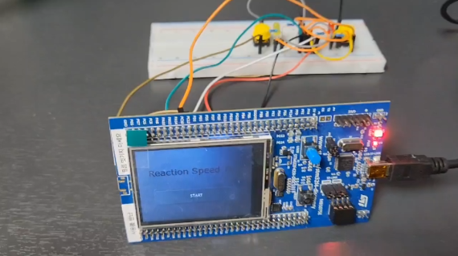

# Reaction Time Test on STM32F429

  
*▲ 프로젝트 전반 구조 또는 동작 화면을 넣을 공간*

---

## 📌 프로젝트 개요
이 프로젝트는 **STM32F429 Discovery 보드**를 사용하여 반응속도를 측정하는 임베디드 애플리케이션입니다.  
LED와 버튼 입력을 활용하여 사용자의 반응 시간을 기록하고, UART 혹은 TouchGFX GUI를 통해 결과를 시각화할 수 있도록 설계되었습니다.  

---

## 🚀 주요 기능
- **LED 시퀀스 점등**: 무작위 지연 시간 이후 LED 점등  
- **버튼 입력 감지**: 사용자가 LED 점등에 반응하여 버튼 입력  
- **반응 시간 측정**: SysTick/Timer 기반으로 반응 시간을 μs 단위 기록  
- **결과 출력**: 
  - TouchGFX 화면에 그래프/텍스트 출력  
- **라운드 진행**: 다회 측정 후 평균 반응속도 계산  

---

## 🛠 개발 환경
- **MCU**: STM32F429ZI (Discovery 보드)  
- **IDE**: STM32CubeIDE / STM32Cube MX / TouchGFX 
- **RTOS**: FreeRTOS 
- **GUI**: TouchGFX  

---

## 📂 디렉토리 구조
```bash
├── Core/                # 메인 소스코드 (main.c, syscalls, startup 등)
├── Drivers/             # HAL/LL 드라이버
├── Middlewares/         # FreeRTOS, TouchGFX 등 미들웨어
├── TouchGFX/            # GUI 프로젝트
├── STM32CubeIDE/        # CubeIDE 프로젝트 파일
├── MDK-ARM/             # Keil 프로젝트 파일
├── EWARM/               # IAR 프로젝트 파일
├── gcc/                 # GCC Makefile 프로젝트
├── *.ioc                # CubeMX 프로젝트 설정 파일
├── changelog.txt        # 변경 이력
└── readme.md            # 본 파일
